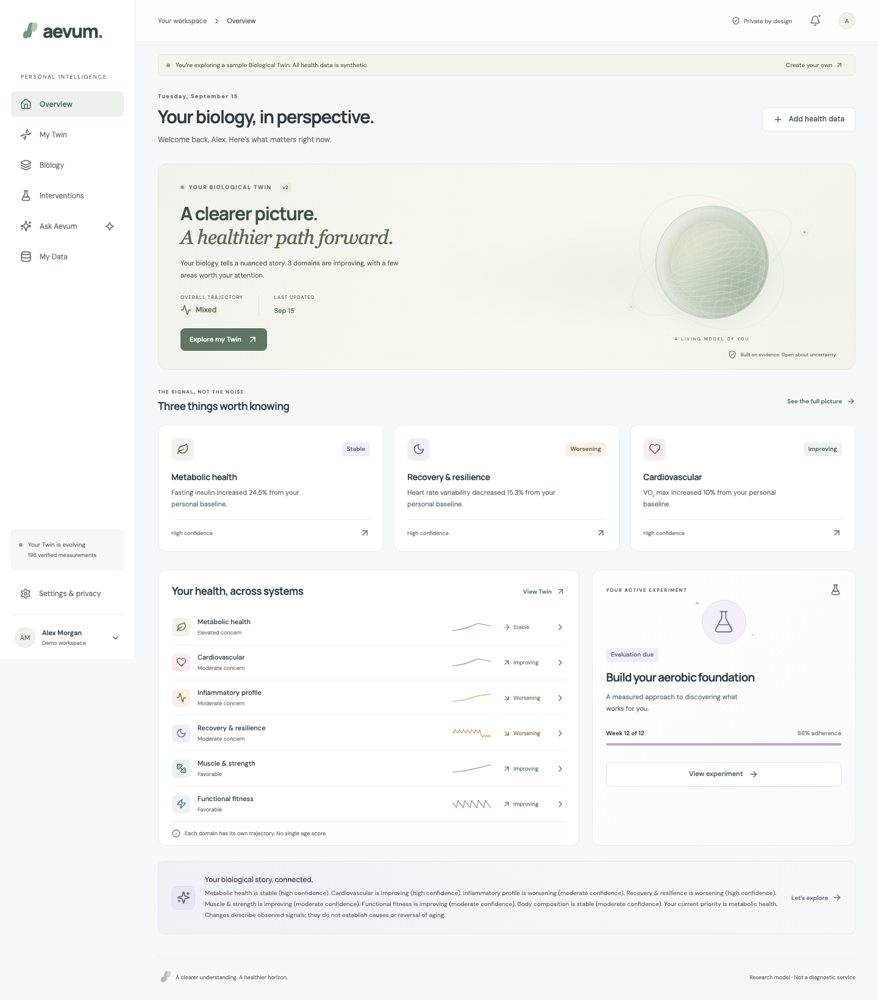
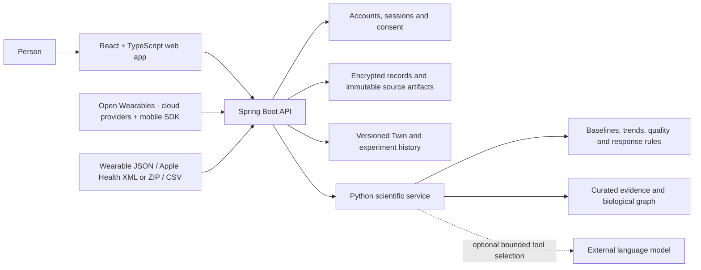
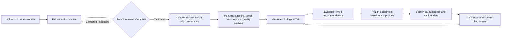
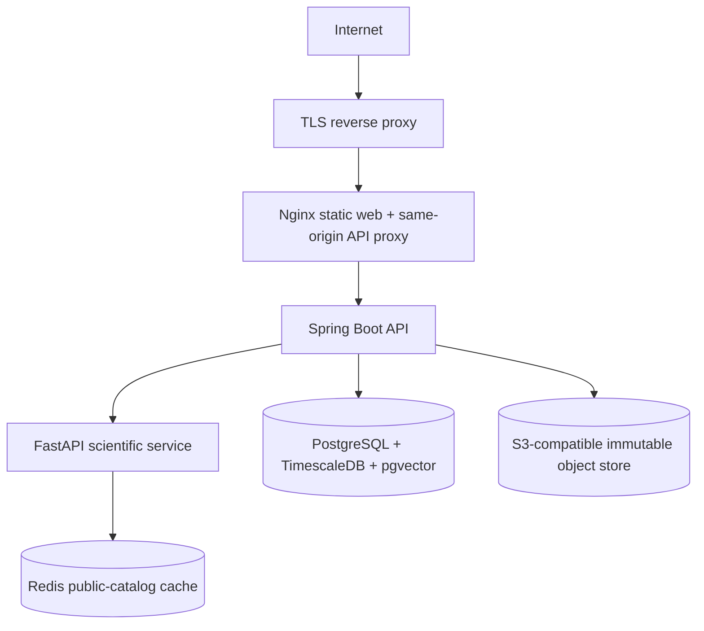

# Aevum

A personal Biological Twin: understand your measurements, explore the biology behind a pattern, choose a measurable experiment, and learn from the response.

Built from scratch from the three supplied specifications. No existing product repository was reused. See [the implementation plan and traceability ledger](docs/IMPLEMENTATION_PLAN.md), [architecture](docs/ARCHITECTURE.md), and [verification / release status](docs/VERIFICATION.md).



## What Aevum delivers

Aevum turns private health measurements into an auditable, longitudinal Biological Twin. It is built around personal baselines, visible uncertainty and evidence-linked claims instead of a single opaque “biological age” score.

- **Private data intake:** CSV and text-PDF laboratory reports, Open Wearables connections and wearable exports, declared-build genotype files, and temporal context questionnaires.
- **A versioned Biological Twin:** domain-level trajectories, source provenance, missingness/freshness, strengths, priorities and Twin history.
- **Biology made inspectable:** observed signals connect to phenotype, process, pathway, hallmark and cited evidence, each with an explicit evidence tier.
- **Action with learning:** goal-aware recommendations, safety gates, frozen experiment baselines, adherence and confounder capture, and conservative response evaluation.
- **Grounded explanations:** every guide response resolves to stored observations, relationships and curated references. The optional language-model adapter can only select a bounded read-only retrieval route.

## System design



The browser never calculates a health state. The Java API owns identity, consent, source ownership, encryption and persistence; the Python service owns validation, features, domain rules, intervention ranking and response evaluation. Raw reports and genomic arrays do not enter the external language-model path.

## From measurement to learning



No observation becomes canonical until the person reviews it. A correction appends a superseding observation; it does not overwrite the original. Experiment outcomes are observational and do not establish causality or reversal of aging.

## Run locally

Requirements: Python 3.10+, Java 21+ and internet access for first-time dependency installation. The bootstrap installs project-local Node 24 and Maven if needed. All generated tooling stays inside this project. A compatible Node already on PATH can also be used.

```bash
python3 scripts/bootstrap.py
python3 scripts/dev.py
```

Open **http://127.0.0.1:5173**. Choose **Explore a sample Twin** for a complete synthetic example, or **Build my Twin** for an empty private account. There is no shared default password. Demo sessions are isolated from real accounts.

Local services: React/Vite `5173`, Spring Boot `8080`, Python analytics `8090`. All bind to loopback. Ctrl+C stops the three services together. Logs live in `.runtime/logs/`.

The local profile persists encrypted records in H2 and encrypted source files on disk. The local key is created with owner-only permissions at `backend/.runtime/local-vault.key`. Keep the key and database together when backing up; losing the key makes records unreadable. Do not overwrite a running JAR; the runner uses a separate copy.

## The complete journey

1. Create an account, choose a goal, add personal context and grant explicit processing consent.
2. Upload historical/current lab PDFs or CSVs. Review extraction, fix values/units/dates and explicitly acknowledge excluded rows. Only confirmed results enter the model.
3. Select and connect an enabled provider through Open Wearables, or import a wearable export. Apple Health and Android health stores use the native companion. Genotype TXT/CSV uploads require separate permission and a declared genome build.
4. Explore Home, domain states, trajectories, strengths, priorities and source provenance. Inspect biological interpretations, evidence tiers and the 12-hallmark framework.
5. Compare personalized options. Freeze a baseline and protocol when starting an eligible experiment. Record adherence, adverse effects and concurrent changes.
6. Add comparable follow-up measurements and evaluate. The response may be favorable, no meaningful response, negative/adverse, or inconclusive. The Twin records a new version. Save Continue / Modify / Stop; a new experiment creates a fresh baseline for a subsequent cycle.
7. Ask contextual questions; inspect the claim’s observations, relationships and scientific references. Manage consent, export the structured record, download original sources, or delete the account.

## Input formats

- **Historical records:** complete JSON bundles preserve all source lab results, qualified values, historical questionnaire timestamps and an accompanying informational review. Supported numeric measurements update the Twin; other results remain visible and unscored. See [historical import workflow and schema](docs/HISTORICAL_IMPORTS.md). Private client bundles must never be committed to this repository.

- **Labs:** text-based PDF or CSV. CSV columns: `biomarker,value,unit,date,reference_low,reference_high`. See [the CSV template](fixtures/lab-template.csv). Dates must be ISO `YYYY-MM-DD`. Ambiguous extraction is never silently accepted. Scanned/complex PDFs fall back to source review and manual entry; OCR is not silently simulated.
- **Wearable:** Open Wearables syncs produce reviewable imports. Oura v2 JSON exports, Apple Health XML/ZIP and the daily wearable CSV template remain supported. Steps, sleep, resting heart rate and RMSSD HRV retain provider provenance; SDNN is not interpreted as RMSSD. See [integration and native companion setup](docs/OPEN_WEARABLES.md).
- **Genotype:** `# build 37` or `# build 38`, then `rsID chromosome position genotype`. Build-specific coordinates are retained; no unvalidated liftover is performed. The first annotation panel is intentionally narrow: SLCO1B1 medication context requiring confirmation. Raw variants are stored separately and never sent to the language model.
- **Context:** temporal structured lifestyle, medical and family-history questionnaires. Unknowns stay unknown.

## Repository map

| Area | Responsibility |
|---|---|
| `web/` | React interface, responsive UX, charts, accessibility and browser journeys |
| `backend/` | Identity, consent, encrypted persistence, import review, source storage, Twin versions and experiments |
| `analytics/` | Canonicalization, scientific rules, evidence catalog, retrieval, ranking and response evaluation |
| `infra/` | PostgreSQL/TimescaleDB/pgvector initialization |
| `scripts/` | Bootstrap, local development, test and environment-secret generation |
| `docs/` | Requirements traceability, architecture and verification/release boundaries |

## Safety, privacy and scientific boundaries

Health and genomic payloads are encrypted with AES-256-GCM. Passwords are BCrypt-hashed; session tokens are random, stored as hashes and issued in HttpOnly, SameSite cookies. Consent is separately versioned for health, wearable, genomic, AI, clinician and research scopes. Revoking wearable processing removes provider tokens and recomputes the current Twin without wearable signals; historical Twin versions that contain them become inaccessible until consent is restored.

The scientific model uses lab-provided reference intervals, personal historical medians, time-aware trends, wearable 7-day versus preceding-28-day comparisons, source quality, freshness, persistence and cross-signal agreement. It deliberately does not diagnose disease, prescribe medication, infer disease from family history/DNA, manufacture population norms, or claim that biomarker movement reverses aging.

## Tests

```bash
python3 scripts/test.py
# With the application running in another terminal:
python3 scripts/test.py --browser
```

The test runner covers scientific rules and parsers, Java identity/privacy/storage checks, TypeScript/build, browser journeys and automated accessibility checks. Browser tests create their own synthetic/demo or test accounts.

## Deployment topology



```bash
python3 scripts/generate_env.py
# Set optional provider credentials in .env, then:
docker compose up --build
```

Open `http://127.0.0.1:8088`. The Compose profile provides PostgreSQL/TimescaleDB, pgvector, S3-compatible MinIO, Redis, Python analytics, Spring Boot, and an Nginx-served web build. Only the web service is exposed, on loopback. For a public deployment, add a TLS reverse proxy, set `AEVUM_ENV=production`, configure the public application URL, and follow the deployment checklist in the architecture document. This is a deployment configuration, not a claim of a production launch or independently validated clinical system.

For a managed MVP deployment, follow the [Railway deployment runbook](docs/RAILWAY_DEPLOYMENT.md). It uses a public web service, private API and analytics services, Railway PostgreSQL and Redis, and a private Railway Bucket. The containers read Railway's runtime port and private-network settings directly.

## Optional live integrations

- **Wearables:** Open Wearables is the single live connection service. Follow [the Railway and mobile runbook](docs/OPEN_WEARABLES.md) to deploy it, enable approved providers, and provision the server credentials. A missing connection service is clearly reported; file imports remain available.
- **External AI routing:** set `OPENAI_API_KEY` on analytics (recommended `LLM_MODEL=gpt-6-luna`). The language model selects a bounded read-only retrieval tool; the system renders authoritative structured claims with provenance. Only the question and tool schemas leave the service, not the full health record or raw genotype. Invalid tool calls, timeouts, or unavailable credentials fall back to the clearly identified deterministic guide. Free-form medical generation is deliberately excluded. Anthropic remains available when `OPENAI_API_KEY` is unset.
- **Scientific retrieval:** a small curated, cited corpus with structured metadata plus 384-dimensional signed-hash vectors. The PostgreSQL profile uses pgvector; local review uses the identical cosine representation. These are transparent lexical vectors over curated summaries, not a claim of broad literature search or learned semantic embeddings.

## Scientific scope

This is an engineering MVP with interpretable, versioned research rules. It does not produce a single biological age, diagnose disease, prescribe drugs, infer a current disease from DNA/family history, or equate improved biomarkers with reversal of aging. Source intervals, personal baselines, time-aware trends, persistence, cross-signal agreement, quality, missingness and uncertainty remain visible.

The PDFs do not supply validated model coefficients, calibrated age/sex reference cohorts, a clinically reviewed annotation database, or a prospective validation study. Those are explicit clinical-release gates, not facts the software can manufacture. See the verification report for tested behavior and remaining external dependencies.

## Documentation

- [Requirements traceability and implementation phases](docs/IMPLEMENTATION_PLAN.md)
- [Architecture and operating notes](docs/ARCHITECTURE.md)
- [Railway deployment runbook](docs/RAILWAY_DEPLOYMENT.md)
- [External integration setup](docs/EXTERNAL_INTEGRATIONS.md)
- [Verification results and release boundaries](docs/VERIFICATION.md)
