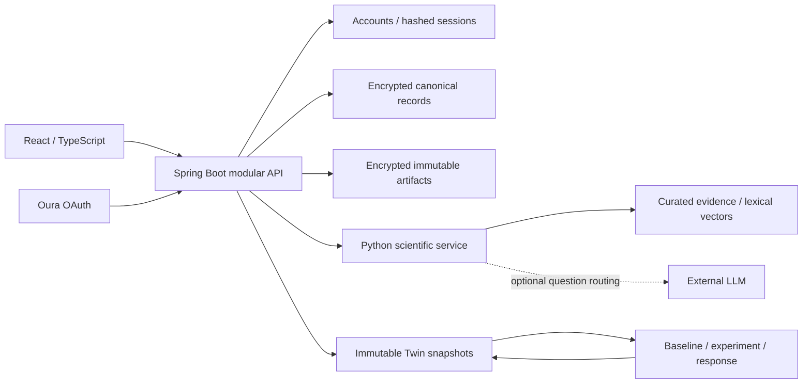

# Architecture and operating notes

## System boundaries

The browser is an interface; it does not calculate authoritative health states. Spring Boot owns identity, consent, source ownership, transactions, persistence, events and external credentials. Python owns canonical validation, scientific features, phenotype rules, evidence, ranking, response calculations and bounded explanations. Raw reports and genotype arrays never enter the external language model.

## Profiles

| Component | Local review | Container deployment |
|---|---|---|
| API | Spring Boot 3.5.12 / Java | Same module on Java 21 |
| Analytics | FastAPI / Python | Same service in Python 3.12 container |
| Persistence | File H2, PostgreSQL compatibility mode | PostgreSQL 17 with TimescaleDB |
| Observation time index | Indexed relational table | Timescale hypertable |
| Raw documents | Encrypted, create-only local files | Client-encrypted, create-only S3 objects in MinIO |
| Evidence vectors | Deterministic cosine search in Python | pgvector, 384 dimensions, cosine index |
| Public catalog cache | In-process packaged catalog | Optional Redis cache with password |
| Jobs | Durable SQL event outbox and scheduled worker | Same worker in API; no extra microservice required |
| Web | Vite development server on loopback | Static build through Nginx, same-origin API proxy |

The local profile is for runnable review, not a claim that H2 implements TimescaleDB. The deployment profile provisions the specified services. Docker could not be runtime-verified in the build environment because no Docker daemon was available.

## Canonical records and provenance

The encrypted `records` table is the authoritative versioned entity store. It contains typed `profile`, `lifestyle_fact`, `family_history`, `medical_context`, `consent`, `artifact`, `import`, `observation`, `variant`, `genomic_finding`, `experiment`, `response`, `twin`, `recommendation_snapshot`, `claim`, `notification` and `audit` records. Every query is bound to the session's pseudonymous person ID; callers never select a person ID.

`accounts` keeps login identity separate. `sessions` stores SHA-256 token hashes and expiration. `observation_index` projects concept, person and measurement time into a queryable relational/time-series index while leaving the health payload encrypted. The public knowledge graph uses `scientific_evidence` and `biological_relationships`; each relationship retains the phenotype, process, pathway, hallmark, evidence tier, confidence, population, direction, review date and limitations.

Context versions and individual lifestyle/family/medical facts carry a common `context_version`. A fact applies from its source snapshot until a later context version supersedes it. Family history and user-reported conditions are labeled as reported context, never machine-established diagnoses.

A source is hashed and encrypted before parsing. Its bytes are never overwritten. Import review is separate from confirmation. Confirmation validates all accepted rows before publishing them transactionally. Corrections append a new observation with `supersedes` and `correction_reason`; the original remains available in export and audit. Duplicate files are detected per person/type/hash; duplicate canonical measurements do not inflate signal confidence. Scanned and uncertain PDFs produce explicit review issues.

## Scientific methods and limitations

- Interpretable, versioned research rules; no learned clinical calibration is claimed.
- Lab-provided reference intervals, unit normalization and plausibility validation. No fabricated age/sex population percentile tables. Missing age/sex context limits confidence.
- Personal baselines use historical medians; trends use direction, magnitude and baseline variability, with at least two suitably separated measurements. Time-aware least-squares slopes are retained as features.
- Wearable comparisons use recent seven-day values against the preceding 28-day window. The latest date's sampling period is respected. Multiple observations on a day do not multiply confidence.
- Lab data older than 180 days and wearable data older than seven days cannot generate a current high-confidence priority. These freshness windows are research policy, not validated clinical thresholds.
- Persistence is the latest uninterrupted run of abnormal values. Cross-signal agreement and functional relevance remain inspectable.
- A decrease is not automatically favorable: crossing below a lower reference boundary can worsen the signal. Body weight has no unconditional favorable direction.
- A model can be favorable in one domain, worsening in another, and unmeasured elsewhere. Every one of the 12 hallmarks exists in the ontology, but only a small evidence-classified subset is connected to current phenotypes.
- Genetic annotation is narrow and conservative. Build-specific coordinates are preserved; a curated SLCO1B1 locus needs clinical confirmation and professional interpretation. No polygenic score, whole-genome interpretation, automated drug selection, or direct aging estimate is inferred.
- Ranking is a transparent heuristic using biological relevance, evidence strength, goal, feasibility/burden, measurability and safety. Contraindications block starting. Clinical/supplement review requirements remain hard gates. Some personal applicability cannot be established from the initial catalog and is explicitly uncertain.
- Experiments freeze the protocol, relevant source observations, baseline values, prior trends, variability and a predefined threshold. Follow-up must occur after the start, near the planned assessment window, be recent and use comparable sources. Low adherence, inadequate duration or missing data gives an inconclusive result. Adverse effects take precedence; concurrent interventions lower attribution confidence.
- Before/after response is observational. It cannot prove causality or reversal of biological aging.

## Change processing

Imports, corrections, context updates, experiment starts and response evaluations invoke the scientific service and save a new version when inputs or domain conclusions change. A dirty-concept set allows unrelated domains to retain their previous state; a daily full refresh revisits freshness. Historical Twin versions retain model, ontology, evidence and input snapshot identifiers.

The durable event outbox drives recommendation snapshots. Pending events become completed or failed, never silently disappear. Daily wearable sync and freshness review are scheduled; failed syncs create an actionable notification. Routine recomputation with unchanged inputs/domain conclusions does not manufacture a new version. Notifications focus on changed state, changed data coverage/measurements and experiment outcomes.

The initial worker is designed for one API instance. Horizontal scaling requires distributed job claims, per-person recomputation locking, retries/dead-letter administration and an idempotency policy across replicas. Failed jobs are inspectable in SQL; this MVP does not include an operator console.

## AI and retrieval

The local grounded guide selects relevant domain, biomarker, context, recommendation or experiment information and renders structured claims with observation, relationship and evidence IDs. It is explicitly labeled as deterministic.

The optional external adapter uses the [Anthropic Messages API](https://platform.claude.com/docs/en/api/messages/create) to choose one of five bounded read-only retrieval routes. Tool names and domain arguments are validated against enums; arbitrary tools or free-form model claims are rejected. The selected question and schemas are transmitted, not raw records. Output sentences still come from the structured scientific layer. Missing keys, provider errors and malformed tool choices fall back safely. A live provider call was not made without operator credentials.

Evidence retrieval is limited to curated source summaries. Structured metadata and signed feature-hash vectors are both retained. The optional pgvector query uses the same representation as local cosine search; vectors are lexical features, not a learned semantic model. There is no autonomous, unreviewed paper-to-intervention publishing pipeline.

## Security and privacy

- BCrypt passwords; random 256-bit session tokens; only hashes stored; seven-day expiry; HttpOnly, SameSite=Lax cookies. Secure cookies when `AEVUM_ENV=production`.
- Same-origin API, explicit mutation verification header and cross-site rejection. The state-validated OAuth callback is the sole cross-site GET exception.
- Server-side ownership checks on every private resource, including sources, imports, histories, experiments and Twin versions.
- Separate explicit, versioned consent for health, wearable, genomic, AI, clinician and research scopes. Clinician/research flags are future-facing and currently have no sharing implementation.
- Revoking wearable processing deletes local provider tokens and recomputes the current Twin without those signals. Historical versions containing those signals are inaccessible until consent is restored. Genomic source access and findings are independently gated. Export remains available to the owner for data portability.
- AES-256-GCM encryption of health/genomic record payloads and original artifacts. Original genomic objects have separate namespaces; access is audited. Production deployment requires a managed key strategy and appropriate object-store access policy.
- Source downloads use attachment disposition and nosniff. Health responses use no-store. No external font requests are made; fonts ship with the web bundle.
- Account deletion removes session/account records, time-series projections, encrypted health records and original object keys. Deployed backup-retention/deletion policy must be separately configured; no false claim of deletion from independent backups is made.

## Before public operation

1. Provision TLS, reviewed ingress/access policies, managed secrets, key rotation, backup/restore and deletion-retention procedures.
2. Runtime-test the Docker/PostgreSQL/Timescale/pgvector/S3/Redis profile and exercise restore/recovery. Pin reviewed container digests and scan dependencies/images for the target release.
3. Configure and verify a real Oura app callback, refresh, sync, revocation and rate-limit behavior. Provider credentials are not bundled.
4. Configure an approved external-model account only if desired; review its data handling and consent copy. The app remains usable without it.
5. Conduct clinical/scientific review of thresholds, contraindication coverage, variant annotation, evidence mappings and population applicability. Validate response rules and uncertainty prospectively.
6. Add pilot operations: verified-email/password-recovery delivery, support workflows, account recovery, distributed job retry administration, consent policy review and appropriate jurisdictional/regulatory assessment.

These are explicit release gates. The delivered application is a functioning research MVP with a complete product loop, not an independently validated medical device or a production compliance certification.
