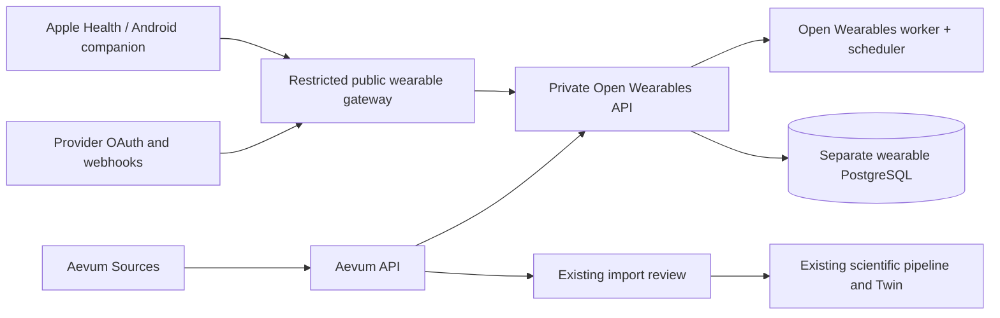

# Open Wearables integration

Open Wearables is Aevum's only live wearable gateway. Aevum contains no Terra client and no direct provider OAuth implementation. Existing Oura JSON imports and prior observations are retained; old direct Oura connections must be reconnected through Open Wearables.

Pinned upstream backend: `the-momentum/open-wearables@ff8527a52ad8a96cd1ebe8c19344295c934ae9dc`.
Pinned mobile SDK: `the-momentum/open_wearables_health_sdk@7439acd71fa76439b7c473b2f99befd291aeb589`.

## Data flow



Users select an enabled provider, authorize it, and return to Sources. Open Wearables owns provider credentials and token refresh. Aevum requests a refresh for providers supporting pull and checks available data every five minutes. A refresh is asynchronous: the first click may return no data while the upstream worker is still fetching. Subsequent polling creates a reviewable source document. No new live imports alter the Twin before user confirmation.

Steps, sleep duration, resting heart rate and RMSSD HRV are normalized. Ordinary heart rate is not relabelled resting heart rate; SDNN is not relabelled RMSSD. Baselines remain separate by provider. Existing scientific thresholds and recommendation rules are unchanged. Other upstream metrics are not silently converted into supported concepts.

## Railway deployment

Keep the existing Aevum services. Add a separate `WearablesPostgres` database and `WearablesRedis` service so wearable records and Celery queues are isolated.

Create these services from the Aevum repository:

| Service | Root directory | Variables / health check |
|---|---|---|
| `open-wearables` | `/infra/open-wearables` | `OW_ROLE=api`, `PORT=8000`; health `/` |
| `wearable-worker` | `/infra/open-wearables` | `OW_ROLE=worker`; no HTTP health check |
| `wearable-scheduler` | `/infra/open-wearables` | `OW_ROLE=scheduler`; one replica, no HTTP health check |
| `wearable-gateway` | `/infra/open-wearables-gateway` | `PORT=8080`, `OPEN_WEARABLES_UPSTREAM=http://open-wearables.railway.internal:8000`; health `/health` |

Give only `wearable-gateway` a public HTTPS domain, for example `https://wearables.example.com`. Its allowlist exposes provider callbacks/webhooks and authenticated SDK routes. Administrative APIs and OAuth initiation remain private. Do not expose the full upstream API directly: its authorization initiation route accepts a user ID without an Aevum session.

Set these on all three Open Wearables application services:

```text
ENVIRONMENT=production
DB_HOST=${{WearablesPostgres.PGHOST}}
DB_PORT=${{WearablesPostgres.PGPORT}}
DB_NAME=${{WearablesPostgres.PGDATABASE}}
DB_USER=${{WearablesPostgres.PGUSER}}
DB_PASSWORD=${{WearablesPostgres.PGPASSWORD}}
REDIS_HOST=${{WearablesRedis.REDISHOST}}
REDIS_PORT=${{WearablesRedis.REDISPORT}}
REDIS_PASSWORD=${{WearablesRedis.REDISPASSWORD}}
REDIS_DB=0
SECRET_KEY=<a separate random 64-byte secret>
MASTER_KEY=<a Fernet key: urlsafe base64 of 32 random bytes>
ADMIN_EMAIL=<your admin email>
ADMIN_PASSWORD=<a unique strong password>
API_BASE_URL=https://wearables.example.com
FRONTEND_URL=https://YOUR_AEVUM_DOMAIN
SENTRY_ENABLED=false
RAW_PAYLOAD_STORAGE=disabled
SDK_PAYLOAD_S3_OFFLOAD=false
OUTGOING_WEBHOOKS_ENABLED=false
ACCESS_LOG_LEVEL=off
LOG_ERROR_RESPONSE_BODY=false
```

Use the same `SECRET_KEY` and `MASTER_KEY` for all three services and retain them with backups. Start API/migrations first, then worker and scheduler. Do not run multiple API migration jobs at once. Outgoing Svix webhooks are disabled because Aevum polls; provider inbound webhooks continue to work. No Svix service is needed for this deployment.

In the API service's Railway shell run `uv run python aevum_admin.py`. It prompts for the seeded administrator credentials and creates one API key and one mobile application. Copy its three values into Aevum's `api` service:

```text
OPEN_WEARABLES_URL=http://open-wearables.railway.internal:8000
OPEN_WEARABLES_API_KEY=<generated server API key>
PUBLIC_APP_URL=https://YOUR_AEVUM_DOMAIN
OPEN_WEARABLES_PUBLIC_URL=https://wearables.example.com
OPEN_WEARABLES_APP_ID=<generated app ID>
OPEN_WEARABLES_APP_SECRET=<generated app secret>
WEARABLE_COMPANION_URL=<HTTPS TestFlight / Play distribution or download-page URL>
```

The provisioning command creates new credentials each time; run it once, or deliberately rotate credentials later. Never put the server API key or application secret in the web or mobile bundle.

## Provider credentials and availability

Configure provider credentials on Open Wearables API, worker and scheduler, never on Aevum. The pinned upstream `backend/config/.env.example` and provider setup guides specify each provider's fields. Examples include `OURA_CLIENT_ID/SECRET`, `WHOOP_CLIENT_ID/SECRET`, `GARMIN_CLIENT_ID/SECRET`, `POLAR_CLIENT_ID/SECRET`, and `SUUNTO_CLIENT_ID/SECRET/SUBSCRIPTION_KEY`.

Register callback URLs in provider dashboards:

```text
https://wearables.example.com/api/v1/oauth/oura/callback
https://wearables.example.com/api/v1/oauth/whoop/callback
https://wearables.example.com/api/v1/oauth/garmin/callback
```

Use the exact path returned/configured by the pinned upstream for other providers; Google retains a legacy callback alias. Configure inbound webhook registration per the provider guide. Enable only configured and approved providers using upstream `/api/v1/oauth/providers` administrative settings. Aevum reads the list and does not fabricate support based on a brand name. Device/account-specific metrics and historical windows vary.

## Apple Watch, Apple Health, Health Connect and Samsung

These require a native application. Aevum includes a mobile companion overlay using the pinned Open Wearables SDK, its native project configuration, and authenticated Aevum sign-in. The SDK handles native permissions, token storage, refresh and background uploads. Users choose an available Android health store. The companion requests only steps, resting heart rate and sleep, which the existing Twin can interpret.

```bash
python3 scripts/prepare_mobile.py
cd .runtime/mobile-sdk/example
flutter pub get
flutter analyze lib/main.dart
flutter run --dart-define=AEVUM_URL=https://YOUR_AEVUM_DOMAIN
```

Before distribution: choose your bundle/application IDs and signing team, retain HealthKit entitlements and background capabilities from the upstream native shell, update app display name/privacy text, and complete Apple/Google/Samsung permission and distribution requirements applicable to the chosen store. Run on physical devices to verify authorization, denial, background delivery, logout and consent revocation. Set `WEARABLE_COMPANION_URL` only when an installable signed build is available. Until then the website explicitly states mobile distribution is not configured.

Mobile login uses Aevum credentials. The authenticated `/api/wearables/mobile/session` endpoint maps the current person to an upstream UUID and returns only user-scoped SDK tokens. Revoking health/wearable consent or deleting an Aevum account deletes the mapped upstream user before reporting success. If the upstream service is unavailable, the operation reports failure so it cannot falsely claim remote deletion. Disconnecting a provider revokes its connection while retaining already reviewed Aevum observations.

Manual imports continue to work without the connection service: Oura JSON, Apple `export.xml`/ZIP (15 MB upload, 100 MB expanded XML), and the downloadable daily CSV template. These are file imports, not additional live integration vendors.

## Verification and rollout

Run `python3 scripts/test.py` and browser tests. Contract tests exercise provider discovery, pagination, credential isolation, consent gates and upstream error handling. Parser tests cover provenance, units, HRV distinctions, device duplication and XML safety. They do not substitute for a provider-account test.

Before inviting pilot users, connect one real consenting account for each enabled cloud provider, verify its callback and background fetch, confirm a reviewed import, repeat the sync to check duplicate prevention, and verify disconnect/consent/account deletion upstream. Back up both databases and their encryption keys. Existing direct Oura token records can be removed after users reconnect; they are no longer used or refreshed.

Upstream references: [backend source](https://github.com/the-momentum/open-wearables), [mobile SDK](https://github.com/the-momentum/open_wearables_health_sdk), [documentation](https://openwearables.io/docs).
