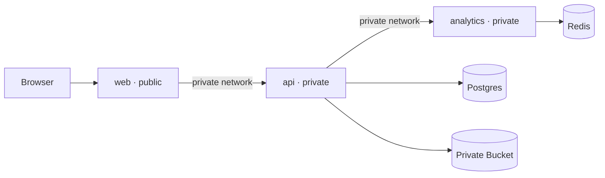

# Railway deployment

This runbook deploys the MVP as three application services and three managed resources. Only the web service receives a public domain.



## 1. Create the project and managed resources

Create a Railway project, then add these resources using the exact names shown:

- `Postgres`: Railway PostgreSQL
- `Redis`: Railway Redis
- `Bucket`: Railway Bucket

The standard PostgreSQL service is sufficient for the pilot. Aevum detects whether pgvector is installed and uses its transparent signed-hash retrieval fallback when it is absent. TimescaleDB and pgvector remain optional optimizations rather than startup requirements.

## 2. Create shared secrets

In the project Shared Variables, create:

```text
ANALYTICS_SECRET=<openssl rand -hex 32>
DATA_ENCRYPTION_KEY=<openssl rand -base64 32>
```

Keep `DATA_ENCRYPTION_KEY` in a separate password manager backup. Existing encrypted records cannot be recovered if this key is lost or changed.

## 3. Add the application services

Add this GitHub repository three times. Set the service name, root directory, variables, and health check for each deployment.

### `analytics`

Root directory: `/analytics`

Health check: `/health`

```text
PORT=8090
ANALYTICS_SECRET=${{shared.ANALYTICS_SECRET}}
REDIS_URL=${{Redis.REDIS_URL}}
ANTHROPIC_API_KEY=
LLM_MODEL=
```

Do not generate a public domain for this service.

### `api`

Root directory: `/backend`

Health check: `/api/health`

```text
PORT=8080
BIND_ADDRESS=0.0.0.0
AEVUM_ENV=production
DATABASE_URL=jdbc:postgresql://${{Postgres.PGHOST}}:${{Postgres.PGPORT}}/${{Postgres.PGDATABASE}}
DATABASE_USER=${{Postgres.PGUSER}}
DATABASE_PASSWORD=${{Postgres.PGPASSWORD}}
ANALYTICS_URL=http://analytics.railway.internal:8090
ANALYTICS_SECRET=${{shared.ANALYTICS_SECRET}}
DATA_ENCRYPTION_KEY=${{shared.DATA_ENCRYPTION_KEY}}
S3_BUCKET=${{Bucket.BUCKET}}
S3_ENDPOINT=${{Bucket.ENDPOINT}}
S3_REGION=${{Bucket.REGION}}
S3_PATH_STYLE=false
AWS_ACCESS_KEY_ID=${{Bucket.ACCESS_KEY_ID}}
AWS_SECRET_ACCESS_KEY=${{Bucket.SECRET_ACCESS_KEY}}
OURA_CLIENT_ID=
OURA_CLIENT_SECRET=
OURA_REDIRECT_URI=
```

Do not generate a public domain for this service. Database initialization is idempotent and runs when the API starts. The connection pool waits for PostgreSQL during a fresh project start; Railway can restart the service if the managed database needs longer.

### `web`

Root directory: `/web`

Health check: `/`

```text
PORT=8080
API_UPSTREAM=http://api.railway.internal:8080
```

Generate a Railway public domain for this service. The Nginx container serves the compiled application and sends same-origin `/api/*` requests to the private API, so browser cookies and CORS stay simple.

## 4. Deploy and verify

Deploy `Postgres`, `Redis`, `Bucket`, and `analytics`, followed by `api` and `web`. Railway does not guarantee Compose-style dependency ordering, so the services also tolerate normal managed-resource startup delays.

Run these checks against the generated web domain:

```bash
curl -fsS https://YOUR_DOMAIN/api/health
curl -I https://YOUR_DOMAIN/
```

Then complete these browser checks:

1. Open the sample Twin and inspect its dashboard and biology views.
2. Create a private account and grant health-data consent.
3. Import `fixtures/lab-template.csv`, review it, and confirm the observations.
4. Sign out and back in to verify PostgreSQL persistence.
5. Download the imported source to verify encrypted Bucket storage.
6. Restart all three application services and repeat the health and sign-in checks.

Enable Railway backups for PostgreSQL before inviting pilot users and test a restoration procedure. Keep the API and analytics services private, rotate secrets after any suspected exposure, and place a custom domain on `web` before configuring Oura OAuth.

## 5. Custom domain and provider callbacks

Add the custom domain to `web`, configure the DNS record Railway supplies, and wait for TLS issuance. Use the final HTTPS origin everywhere. For example:

```text
OURA_REDIRECT_URI=https://app.example.com/api/wearables/oura/callback
```

The redirect URI configured in Oura and the API variable must match exactly.

## Runtime notes

- The containers accept Railway's `PORT` convention and bind on all container interfaces.
- Railway's private DNS names are used for internal traffic; PostgreSQL, Redis, API, and analytics need no public TCP endpoints.
- Railway Buckets use virtual-hosted S3 requests. Local Docker Compose sets path-style mode explicitly for MinIO.
- The local `compose.yaml` remains the complete self-hosted development topology. Railway replaces its database, Redis, and MinIO containers with managed resources.
- Scaled API replicas require a deliberate session/cache and migration strategy. Use one API replica for the first pilot unless load testing shows a need to scale.

